# 科目三路考模拟（KeMuSan Road Test Simulator）

**2026-10-07 更新：** 在10米宽考道与三轴重卡基础上，增加碰撞后的永久局部凹陷、四轮/六轮悬挂、侧倾、轮载转移与重卡高速急转翻覆。[本轮形变与翻覆验收](docs/damage-rollover-verification.md)。

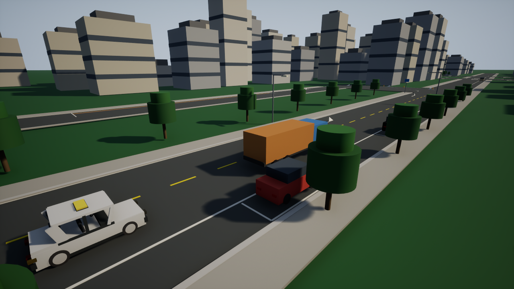


考驾照**科目三（道路驾驶技能考试）**模拟训练系统，基于 **Unreal Engine 5.7** 开发。

用于练习的教学模拟系统，内置 14 类训练项目与项目自定义扣分规则：全程约 1.15 公里（1151.68 米）城市考道与掉头环线，涵盖上车准备、夜间模拟灯光、起步、直线行驶、变更车道、通过路口、通过人行横道、学校区域、公共汽车站、会车、超车、加减挡位、掉头、靠边停车。评分细节与代码逻辑逐项对照，采用 100 分制评判（90 分及格），本系统不宣称任何公安部合规认证。

---

## 快速上手与操作指引

### 1. 编译与启动

1. 环境依赖：**Unreal Engine 5.7** 与 **Visual Studio 2022**（需安装「使用 C++ 的游戏开发」与 Windows 10/11 SDK）。
2. 双击根目录下 `一键编译与运行.bat`，脚本将自动调用 UBT 完成 Win64 Development 构建并以 1280x720 窗口启动。
3. 亦可通过命令行手动构建：
   ```cmd
   D:\UE_5.7\Engine\Build\BatchFiles\Build.bat KeMuSanTrainingEditor Win64 Development -Project="%CD%\KeMuSanTraining.uproject" -WaitMutex
   ```

### 2. 模式选择与主菜单键位

启动进入欢迎界面后，可通过以下按键进入不同模式：

| 按键 | 功能与模式 |
| :--- | :--- |
| `Enter` | **推荐练习模式**：以手动挡进入自由引导练习，适合熟悉键位与驾驶物理 |
| `F1` | **C1 手动挡模拟考试**：严格考试评判，无自动化辅助，检验全流程起步与加减挡 |
| `F2` | **C2 自动挡模拟考试**：自动挡路考评判，操作自动离合变速箱 |
| `Esc` | 暂停游戏 / 继续游戏 |
| `F3` | 查看学员档案与错题复盘；驾驶中自动暂停，关闭后恢复原状态 |

### 3. 驾驶与座舱全套操作键位

| 分类 | 按键 | 功能说明 |
| :--- | :--- | :--- |
| **基础操纵** | `W` / `S` | 平滑油门加速（已内置渐进踏板防起步熄火） / 刹车制动减速 |
| | `A` / `D` | 转向控制（车速关联动态转向比） |
| | `Space` | 机械手刹（准备阶段需保持拉紧，起步挂挡后松开） |
| **挡位与变速** | `1`–`5` | C1 手动挡 1–5 挡直接挂挡（加减挡考核需逐级挂入） |
| | `N` / `R` | 空挡 / 倒挡 |
| | `Tab` | C2 自动挡循环切换挡位（N/R/D）；调镜模式下切换镜面 |
| **考试动作** | `F` | 扣上 / 解开安全带（准备阶段必做） |
| | `M` | 观察后视镜与向左侧头观察（起步、变道、超车、掉头等项目必按） |
| | `B` | 鸣喇叭（超车、学校、人行横道可提示） |
| **灯光系统** | `Q` / `E` | 左转向灯 / 右转向灯（变道与起步须保持打灯 ≥3 秒） |
| | `L` | 灯光总旋钮（关闭 → 示廓灯 → 近光灯 → 远光灯 循环） |
| | `J` | 远近光交替闪烁（通过急弯、坡路、拱桥、人行横道或无信号灯路口） |
| | `K` / `H` | 雾灯开关 / 危险报警闪光灯（双闪）开关 |
| **视角与调镜** | `V` | 切换座舱内第一人称视角（可见镂空三辐方向盘与三面镜）与第三人称追尾视角 |
| | `T` | 开启 / 退出**后视镜光学调节模式** |
| | `Tab` | 调镜模式下循环切换当前调节的后视镜（左外镜 / 内后视镜 / 右外镜） |
| | `↑` `↓` `←` `→` | 调镜模式下微调镜面俯仰角与偏航角（物理反射同步改变） |
| | `R` | 调镜模式下将当前镜面复位至出厂标称物理角度 |

> **灯光模拟答题说明**：
> 在夜间灯光模拟考试阶段，数字键 `1`–`5` 作为答题输入：
> `1` 近光灯 · `2` 远光灯 · `3` 远近光交替 · `4` 示廓灯+危险报警闪光灯 · `5` 雾灯+危险报警闪光灯

---

## 训练项目与扣分规则（100 分制，90 分及格）

系统对照科目三常见考规要点，在代码中内置了 14 项状态机与自定义扣分规则：

| # | 考核项目 | 评判与扣分规则 |
| :---: | :--- | :--- |
| **1** | **上车准备** | 围绕车辆检查、进入座舱系安全带（`F`）、观察仪表与后视镜（`M`）、确认手刹拉紧。未系带或未观察无法进入下一阶段。 |
| **2** | **夜间模拟灯光** | 随机抽取 8 道考题（夜间起步、会车、跟车、超车、路口转弯等），5 秒内完成操作；超时或错选直接评判**不合格**。 |
| **3** | **起步** | 开启左转向灯且满 3 秒、回头观察（`M`）、踩制动挂 1 挡、松手刹（`Space`）平稳起步。溜车 >30cm 不合格，后溜 ≤30cm 扣 10 分，高挡起步或熄火扣 10 分。 |
| **4** | **直线行驶** | 进入区域后保持方向稳定；车身偏航角度 >3° 或车道横向位移 >0.45m 持续 1 秒即扣 100 分不合格。 |
| **5** | **变更车道** | 先左后右连续两次变道：开启对应转向灯并保持 3 秒以上、回头观察后方车流。未打灯扣 10 分，打灯不足 3 秒变道扣 10 分，未观察后方扣 10 分。 |
| **6** | **通过路口** | 遵守红绿灯信号，闯红灯直接不合格；遇黄灯未减速扣 10 分；通过速度超过 35km/h 扣 10 分。 |
| **7** | **通过人行横道** | 减速慢行（车速 ≤30km/h）；若有过街行人横穿必须停车让行，未让行直接不合格。 |
| **8** | **通过学校区域** | 严禁超速，车速超过 30km/h 直接评判不合格。 |
| **9** | **通过公共汽车站** | 减速慢行，车速超过 30km/h 扣 10 分或不合格。 |
| **10** | **会车** | 开启近光灯、保持右侧车道行驶；严禁压中心线或与对向来车抢行。 |
| **11** | **超车** | 必须由左侧相邻车道超车；打左转向灯 ≥3 秒、观察后方、变道提速超越前车、打右转向灯 ≥3 秒返回原车道。右侧超车直接不合格。 |
| **12** | **加减挡位** | 依次平稳加至 4 挡并保持稳定，随后逐级减回 2 挡；越级换挡或速度与挡位严重不匹配扣 10 分。 |
| **13** | **掉头** | 进入专用掉头弧道：提前打左转向灯、观察左后方车流、减速降挡，按既定几何弧线平顺掉头。 |
| **14** | **靠边停车** | 开启右转向灯 ≥3 秒、减速向右靠边；停止后车身右侧距道路边缘石 ≤30cm 满分，30–50cm 扣 10 分，>50cm 或压马路牙子直接不合格；停稳后须回空挡、拉紧手刹。 |

---

## 核心架构与系统设计

```
KeMuSanTraining/
├── KeMuSanTraining.uproject      # UE 5.7 工程定义与插件模块配置
├── Config/                       # DefaultEngine, DefaultInput, DefaultGame 配置
├── Source/KeMuSanTraining/
│   ├── KeMuSanGameMode           # 模式状态机（自由练习 vs C1/C2 正式路考）与实测驱动入口
│   ├── KeMuSanPawn               # 动力学与座舱：镂空中空三辐方向盘、独立轮毂盖、防熄火平滑踏板、三面镜光学控制
│   ├── KeMuSanPlayerController   # 真实按键映射响应、起步至刹停自检、档案交互、独立考试启动验证
│   ├── KeMuSanHUD                # 26pt 主菜单标题与中文 HUD、动态考点卡片与违规清单
│   ├── ExamController            # 14 项路考状态机、动态提示文案、内置评分与违规判定
│   ├── ExamSaveGame              # 跨进程历史存档、考试与练习统计、JSON导出
│   ├── ExamErrorAnalyzer         # 评分规则对应的错误归类与操作建议
│   ├── RoadBuilder               # 程序化考场生成：基于 HISM 的大批量网格实例化渲染优化
│   ├── TrafficActors             # 动态交通流：AI 巡航社会车、过街行人、定时红绿灯
│   ├── BeepSynth                 # 纯物理程序化实时音频合成器（叮声/警示长音/转向继电器/转速引擎音）
│   ├── ExamTypes.h               # 数据结构定义（阶段、挡位、考题、扣分记录）
│   └── RoadLayout.h              # 约 1.2 公里城市道路折线几何与里程映射
└── scripts/                      # 自动化测试与实机验证脚本
```

### 学员档案与复盘

训练或模拟考试结束后自动保存记录。`F3` 可在菜单、考试或结果页打开档案，最近 20 场明细可翻页查看；累计练习场次单独统计，模拟考试的合格率与最高分不受练习影响。

- `↑` / `↓` 选择记录，`PageUp` / `PageDown` 翻页；`Enter` 查看当场详情或返回列表；`Esc` 从详情返回列表，列表中按 `Esc` 关闭；`F3` 随时关闭档案。
- 详情显示扣分原因、发生时间、项目完成情况及对应的操作建议。分析来自项目评分规则，未接入外部 AI 服务。
- 学员记录保存在 `Saved/SaveGames/KeMuSanExamSave.sav`，同时导出可阅读的 `ExamHistory.json`；重启后仍可查看。此功能保存已结束场次，暂不恢复未结束的驾驶进度。
- 读取损坏存档时保留原文件，并提示恢复备份；写入失败会显示存档与 JSON 的各自结果。
- 自检使用独立测试槽和目录，避免把模拟扣分加入正式档案。

### 车辆物理（2026-10-07）

考试车1400kg，普通社会车1500kg，重卡14000kg。车辆使用Chaos动态碰撞体、摩擦/恢复系数、连续碰撞检测和物理子步；油门、刹车及转向施加力/力矩，AI从实际位置更新路线进度，不用每帧瞬移覆盖撞击反应。练习中可挂R挡倒车脱离，考试碰撞判定来自实际接触事件。

现已开放高度、俯仰和侧倾：射线悬挂在轮点施加弹簧与阻尼力，轮胎力按轮载和摩擦上限作用于地面接触点。低速转弯稳定，高速会侧倾/侧滑；高重心重卡可翻覆。车身、保险杠、引擎盖和货箱采用细分程序化面板，撞击冲量驱动累计凹陷，重新开局或车流回收时修复。翻覆后停止正常驱动力并显示中文重开提示。

参考 [Bullet RaycastVehicle](https://github.com/bulletphysics/bullet3/blob/master/src/BulletDynamics/Vehicle/btRaycastVehicle.cpp) 的轮点悬挂、摩擦限制和翻滚力臂，以及 [Mesh Deformation Toolkit](https://github.com/normalvector/ue4_mesh_deformation_toolkit) 的加权顶点形变/法线更新思路，独立编写了适配当前程序化车型的实现；未导入旧UE4插件或第二套物理引擎。当前为刚体底盘加表面塑性凹陷，碰撞包络保持刚性，尚未实现逐片钣金的软体求解、零件脱落和材料撕裂。[实现范围与实机证据](docs/damage-rollover-verification.md)。

`run_vehicle_physics_test.ps1` 在真实游戏进程中验证六类碰撞（普通车追尾、重卡质量差、偏置侧撞、对撞、倒车接触和高速CCD），并检查玩家车凹陷、修复、车流回收、悬挂转弯与重卡翻覆、车顶落地。碰撞和高速转弯夹具赋一次初速度，后续由Chaos求解，原生驾驶输入另行验证；不代表完整人工路考已通过。

| 真实撞击后的车身凹陷 | 重卡高速急转翻覆 |
| :---: | :---: |
| 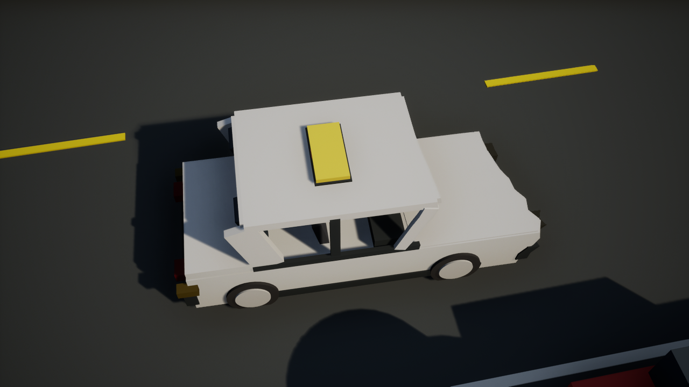 | 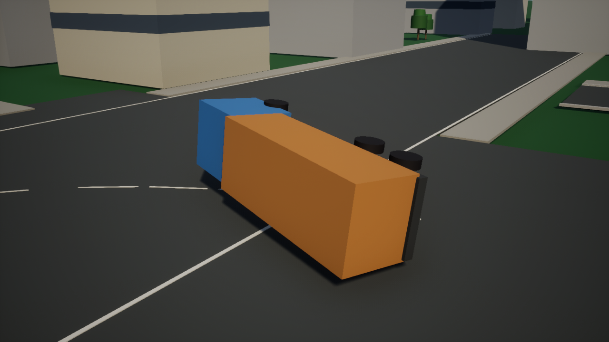 |

### 1. 文字提示与声音反馈
- **提示机制**：采用全中文 HUD 实时文字提示与程序化高保真合成提示音相结合，清晰指示考点与操作要点（系统当前未包含真人中文 TTS 语音库）。
- **程序化音频合成**：基于 `USoundWaveProcedural` 生成 16-bit PCM 波形，动态合成起步叮音、考点双音、违规警告音、转向继电器脉冲以及随转速（RPM）变化的引擎声，无需依赖任何第三方外部音频。

### 2. 性能与渲染架构优化
- **HISM 批量实例化**：`ARoadBuilder` 生成约 1.2km 的复杂路网、双黄线、斑马线、路缘石及安全护栏时，自动按材质与静态网格聚合为 `UHierarchicalInstancedStaticMeshComponent`。将全城近 3000 个独立 Actor 组件合并至少量批次中，大幅减少 Draw Call。
- **后视镜时间切片渲染**：座舱内左外镜、右外镜与内后视镜分别采用独立反射相机。为减轻集成显卡负担，系统采用 Round-Robin 时间切片调度，单帧仅捕获一面镜子（总刷新率限制在 30Hz，单镜约 10Hz），实现流畅运行与镜面动态车流的兼顾。
- **历史构建实测运行帧率记录（2026-10-06，加入刚体物理前）**：在 Intel Core Ultra 5 225H / Intel Arc 130T、1280×720、Lit 光照、HISM 与 3 面动态后视镜条件下，使用 CSV Profiler 记录 `full_mix`（种子20260823）的真实墙钟帧时间。运行包含每4秒截图的 `-autotest`；丢弃初帧并预热 20.002 秒，随后 26.609 秒内采样 1382 帧，平均 **51.938 FPS**。此值只代表该条件下的采样平均值，不能推断整段路线或最低帧率。

---

## 自动化测试与质量验收

系统内置严格基于真实 `InputKey` 输入链的自动化测试套件：

### 1. 真实按键输入链闭环（`run_input_chain_test.ps1`）
通过实际按键（`Enter` → `F` 安全带 → `M` 观察后视镜 → `Space` 保持手刹至准备完成 → `Q` 左转向灯满 3 秒 → `1` 挡挂挡 → `Space` 松手刹 → `W` 持续加速位移 ≥14m 且速度达到 Driving → `S` 刹停）检验整套起步与驾驶逻辑，并独立验证 F1/F2 启动契约。

### 2. 多场景交通规则回归（`run_traffic_regression.ps1`）
覆盖 `empty`、`crosswalk_yield`、`follow_and_meet`、`full_mix` 四个交通场景，校验场景启动与完成、行人让行事件、车辆事件、显示状态及当次截图。

### 存档与错误分析（`run_archive_and_analysis_test.ps1`）

使用独立 `KeMuSanTest_` 槽位和 JSON 文件，两个游戏进程分别创建记录和重开读取 `.sav`，校验考试/练习统计、去重、分类及 F3 档案交互。人工注入的扣分只用于验证归档与分析，不表示完成了全程路考。

### 连续路线与掉头判定（`run_route_geometry_test.ps1`）

在真实 UE 中检查路线重复构建、样本位置与切线连续、里程与投影往返、掉头进入最终回程段才完成，以及左转累计角度。测试姿态仅验证几何与判定，完整人工驾驶仍需独立验收。

### 3. 实机驾驶与镜头展示（`run_showcase_capture.ps1`）
自动捕获实机运行画面：主菜单大标题、真实行车追尾动态、第一人称镂空方向盘与后视镜、镜面调节光学变化对比、90° 弯道与 180° 掉头静态镜头测试等全套验证截图。

---

## 新增档案与复盘界面（2026-10-06）

下面的档案画面来自独立验收槽中的 6 条演示记录，展示保存、翻页与错误分析功能；分数与场次不是用户的实际考试成绩。新掉头道路图是静态俯视展示。

| 学员档案与分开统计 | 单场扣分与操作建议 |
| :---: | :---: |
| 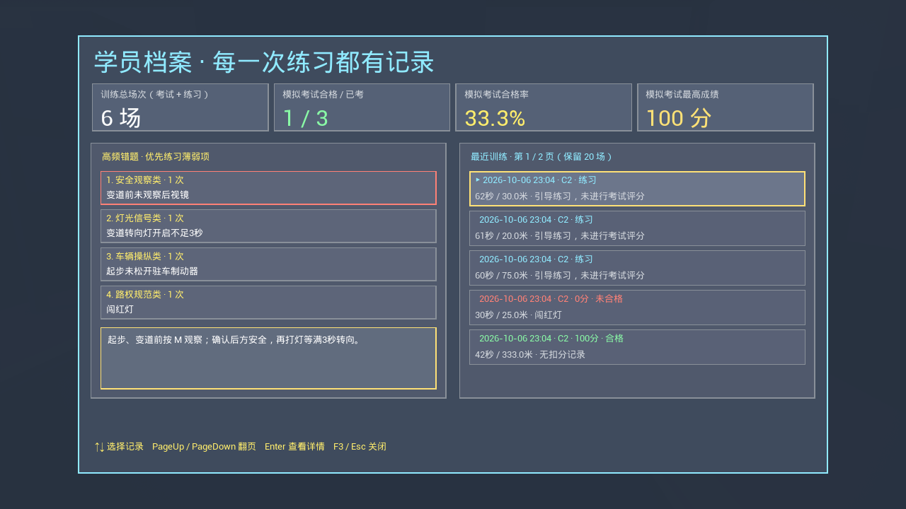 | 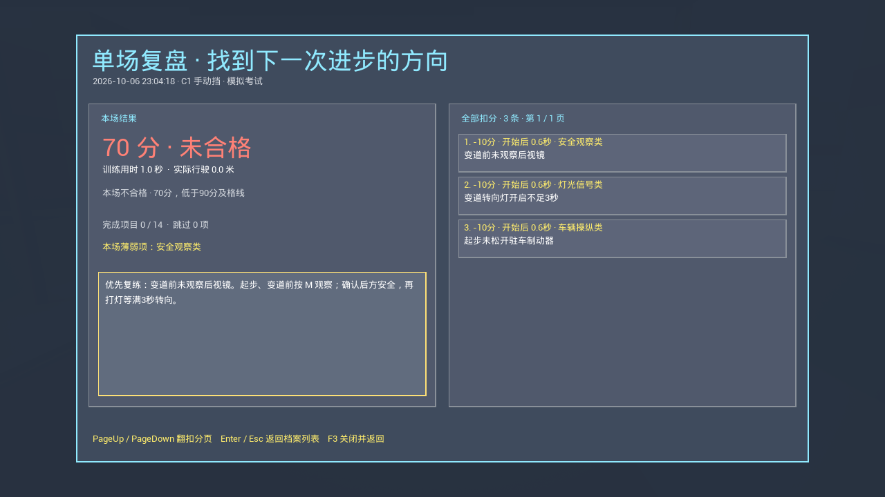 |

| 当场训练总结 | 连续掉头道路与回程车道 |
| :---: | :---: |
| 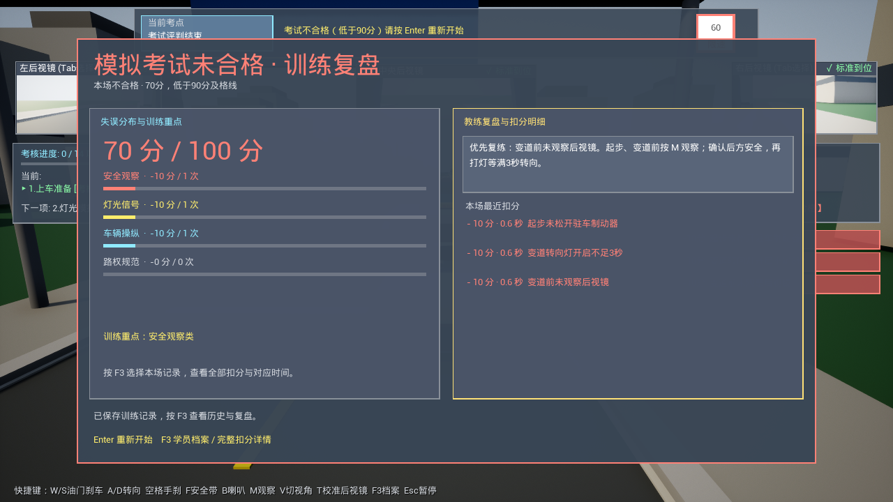 | 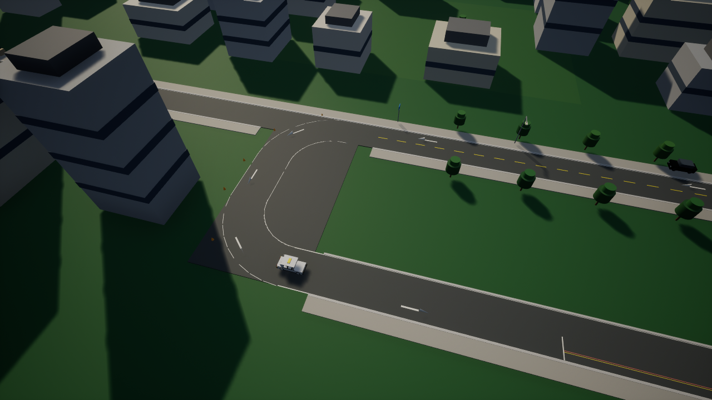 |

## 实机驾驶与镜头效果（2026-10-05画面）

| 主菜单与按键指引 | 真实驾驶（20 km/h 动态追尾） |
| :---: | :---: |
| 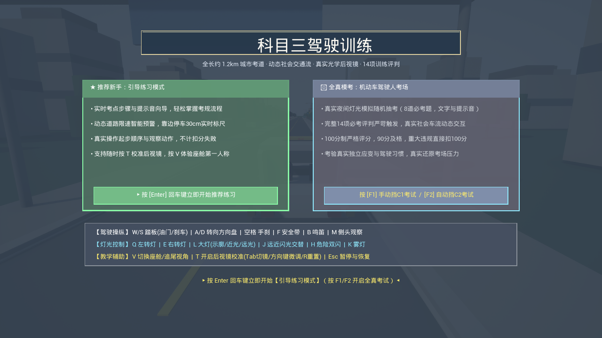 | 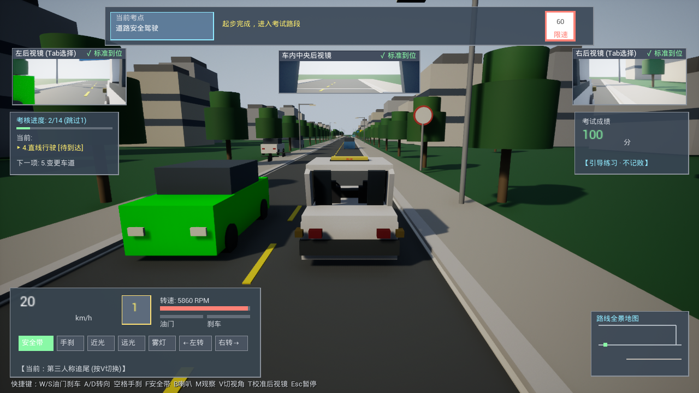 |

| 第一人称座舱（中空三辐方向盘与三面镜） | 90° 静态镜头测试（北向右车道对齐） |
| :---: | :---: |
| 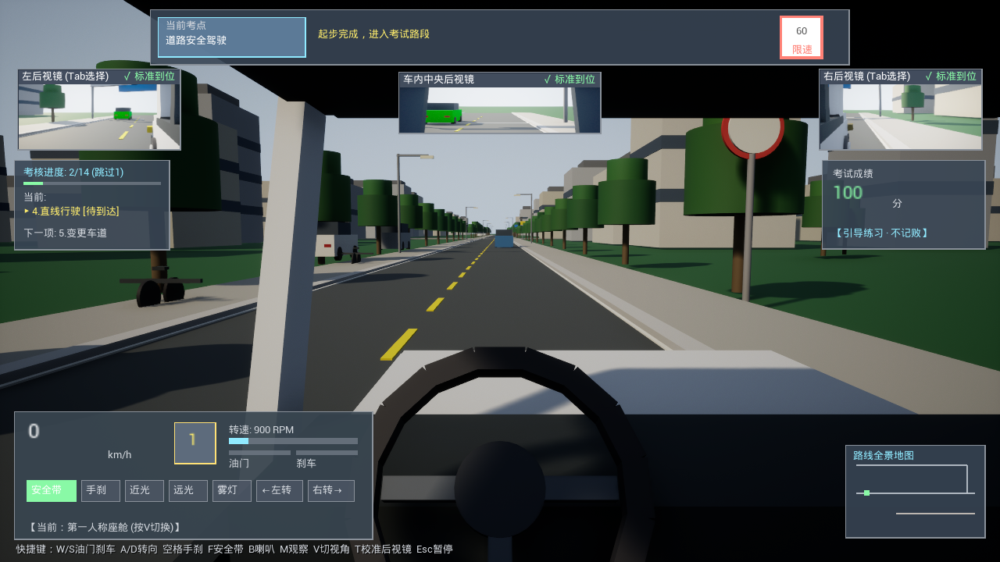 | 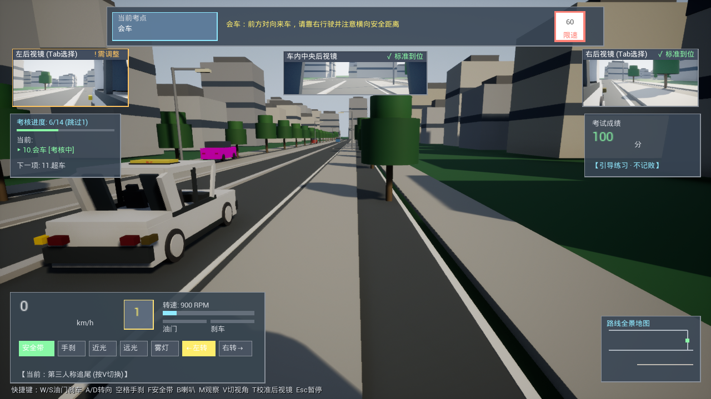 |

| 后视镜微调 - 默认镜面角度 | 后视镜微调 - 偏角对比（同位静止反射对比） |
| :---: | :---: |
| 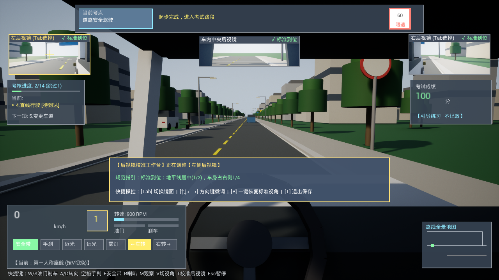 | 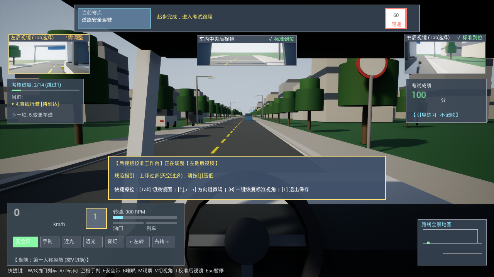 |

| 180° 静态镜头测试（西向右车道掉头朝向） | |
| :---: | :---: |
| 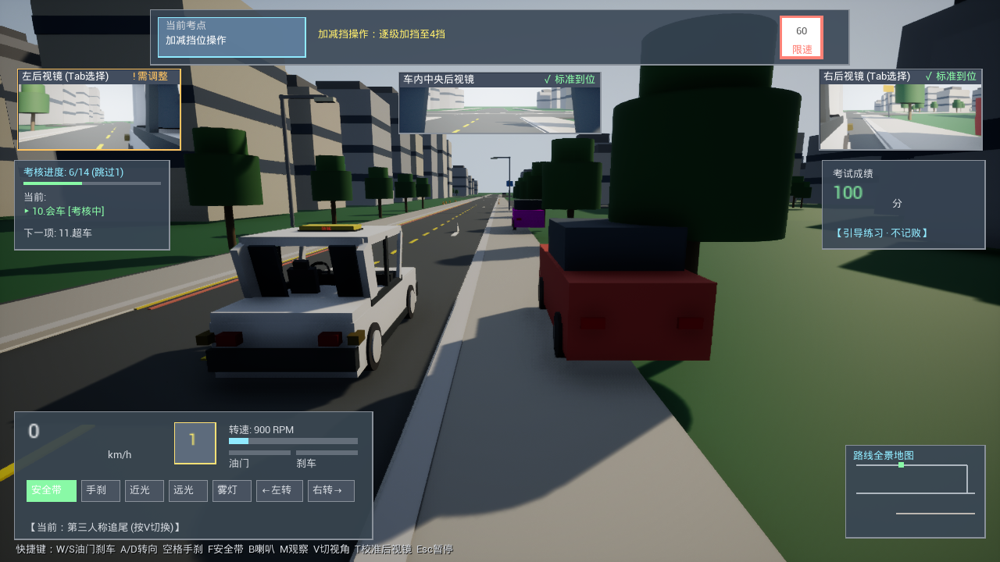 | |

---

## 开源协议

本项目采用 [MIT 许可证](LICENSE)。
