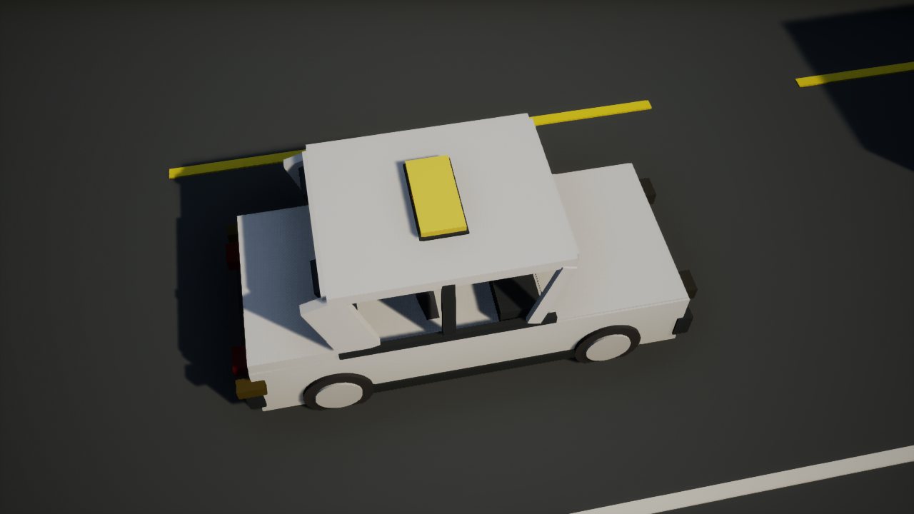

# 碰撞形变、悬挂与翻覆验收（2026-10-07）

本轮在10米宽考道、停车带与三轴重卡基础上，补上永久局部凹陷和三维车辆动力学。旧水平碰撞构建的证据保留在 [道路重卡历史验收](physics-verification.md)。

## 实现范围

车身、保险杠、引擎盖、车顶与货箱转换为细分程序化面板。真实Chaos接触冲量除以车辆质量得到碰撞速度变化，以位置、方向和半径衰减驱动局部累计凹陷，再在线性时间内重算法线。轻微接触低于阈值不凹陷，单顶点累计位移限制为60厘米；重新开局或车流回收恢复原始顶点。座椅、仪表、方向盘、后视镜和车轮保留原有组件及运动。

车辆开放高度、俯仰和侧倾，开启重力。独立组件执行四轮/六轮射线悬挂，弹簧与阻尼在轮点受力；轮胎驱动、制动及横向力合并后按轮载×摩擦系数限制，作用于地面接触点。力臂、左右轮载变化及重力产生侧倾和翻覆，没有按速度阈值设置旋转或播放翻车动画。轿车可先侧滑，高重心重卡更容易翻覆。车轮/轮毂随悬挂行程移动，翻覆后停止正常驱动力，显示中文重开提示；考试中翻覆进入不合格规则。

整车质量保持考试车1400kg、普通车1500kg、重卡14000kg；车顶/货箱与底盘焊接为同一刚体，分配质量并校准整体重心，避免翻覆后车顶穿地。回收时同时关闭底盘和车顶碰撞，再激活恢复质量/重心及碰撞。复合车顶形状的接触通知转发到正常损伤和事故处理。

这是刚体底盘加表面塑性形变的实时近似。碰撞包络保持刚性，未实现逐片钣金的软体/FEM求解、材料撕裂、零件脱落和损伤后的发动机/轮胎机械故障。参数为本项目设定，未声称具体量产车型实测。地面为平面碰撞支撑，装饰建筑与路缘尚未加入阻挡物理。转向仍由目标偏航率控制，未移植完整轮胎模型。

## 本次真实构建和检查

UE5.7.4 Win64 Development Editor编译成功，保留既有InputKey弃用警告。DLL SHA-256：`B4DBC6EEC6506A66698C92F09659D55B4E91AFD69DD74E8A06D91B710B323B84`。

五套脚本以单个UE实例逐项运行，在同一DLL上成功退出，读取当次日志及截图，正式学员.sav与JSON前后哈希一致：

- `run_vehicle_physics_test.ps1`：六种实际撞击、低速稳定转弯、高速重卡翻覆/轿车侧倾、轻微接触保护，另有玩家车真实撞击、已损坏车修复、碰撞回收、再次激活后的整车质量/重心和翻覆车顶接触检查。
- `run_route_geometry_test.ps1`：路线连接、切线、里程、投影和掉头判定。
- `run_archive_and_analysis_test.ps1`：两进程存取、扣分类别、去重、损坏保护、F3原生交互及暂停状态。
- `run_input_chain_test.ps1`：原生按键完成准备、起步、真实位移和刹停，以及F1/F2考试启动。
- `run_traffic_regression.ps1`：empty、crosswalk_yield、follow_and_meet、full_mix四场景。

玩家车与重卡实际撞击后的最大顶点位移为 **36.646cm**，受损顶点 **984** 个。该值是模型顶点位移，不代表实车碰撞安全指标。

| 实际转弯夹具 | 最大侧倾/翻滚角 ° | 最小车体上向量Z | 结果 |
| --- | ---: | ---: | --- |
| 轿车低速转弯（18km/h，目标偏航0.3rad/s） | 1.49 | 1.000 | PASS |
| 重卡高速急转（108km/h初速度，目标偏航0.7rad/s） | 102.89 | -0.223 | PASS |
| 轿车高速急转（108km/h初速度，目标偏航0.7rad/s） | 7.31 | 0.992 | PASS |

转弯夹具先静止稳定，然后赋予一次初速度并持续施加驾驶力/力矩；后续位置和旋转由Chaos求解。重卡翻覆断言要求明显翻滚、车体上向量穿过水平，并确认没有与其他车辆接触。另用倒置车垂直落下的独立夹具验证车顶接触、形变与最低碰撞形状不穿地。撞击/高速夹具不代表玩家使用原生按键完成这些动作；原生准备、起步与制动通过独立输入测试验证。未声称整段路考已自动驾驶通过，也未重新测量本轮帧率。

## 实机截图

碰撞前：

真实碰撞后，移开测试重卡以便观察，凹陷保留：

重卡高速急转导致翻覆：

## 已查阅的原始参考

- [Bullet RaycastVehicle.cpp](https://github.com/bulletphysics/bullet3/blob/master/src/BulletDynamics/Vehicle/btRaycastVehicle.cpp)，[zlib许可证](https://github.com/bulletphysics/bullet3/blob/master/LICENSE.txt)：参考轮点射线、弹簧阻尼、按轮载限制摩擦及接触力臂产生翻滚的方法。
- [Mesh Deformation Toolkit](https://github.com/normalvector/ue4_mesh_deformation_toolkit)，[MeshGeometry.cpp](https://github.com/normalvector/ue4_mesh_deformation_toolkit/blob/master/MeshDeformationTK/Plugins/MeshDeformationToolkit/Source/MeshDeformationToolkit/Private/MeshGeometry.cpp)，[MIT许可证](https://github.com/normalvector/ue4_mesh_deformation_toolkit/blob/master/LICENSE)：参考按权重改变顶点、上传程序化网格和更新法线。
- [Async-Physics-Suspension/Suspension.cpp](https://github.com/fgrenoville/Async-Physics-Suspension/blob/main/Source/AsyncPhxSuspension/Private/Suspension.cpp)：参考UE中四点悬挂受力的组织。
- [Epic City Sample车辆形变说明](https://dev.epicgames.com/documentation/en-us/unreal-engine/city-sample-project-unreal-engine-demonstration#dynamicvehicledeformation)：确认官方样例通过多刚体、约束塑性及Control Rig实现更完整的动态形变。当前程序化车型没有其骨骼与资产，因此独立实现了可兼容现有模型的表面形变。

本轮独立编写实现，未复制上述仓库代码，未引入旧UE4插件、Bullet/Jolt第二套求解器或City Sample资产。运行时只新增UE自带ProceduralMeshComponent依赖。
